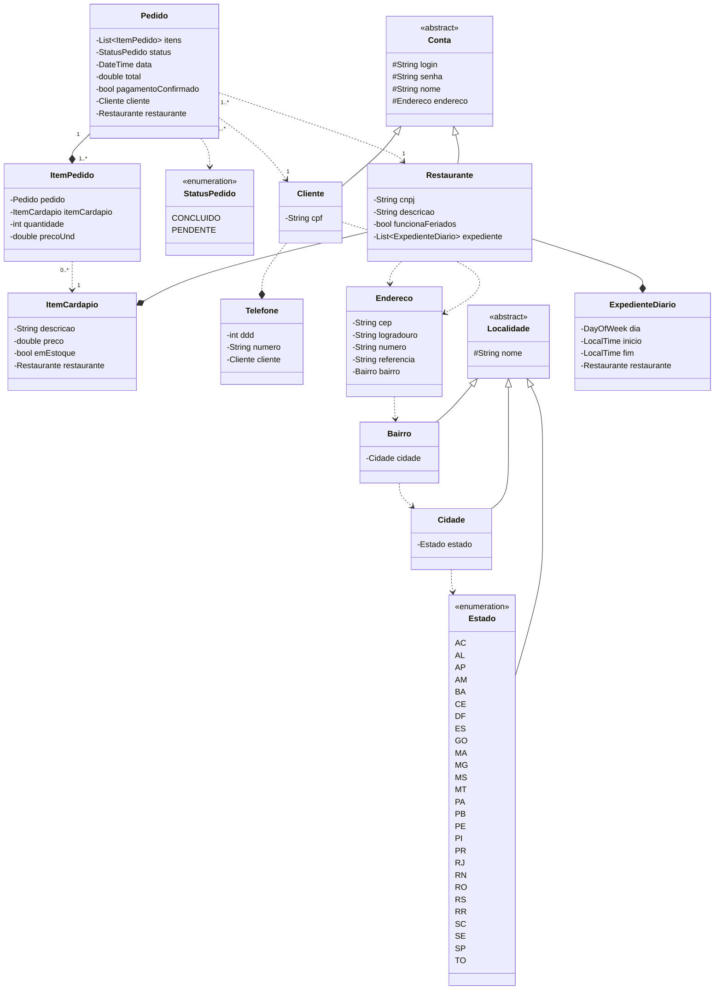

## Desafio final - DIO Santander Java Backend 2023

[&larr; Voltar](../README.md)  
[&uarr; Ir para o projeto](src/main)

Solução: Desenvolver um protótipo de aplicação que simule o iFood

Trata-se de uma aplicação multi-tenant em que o database e o schema são compartilhados

### Observações

- O sistema de pagamentos foi desconsiderado devido sua complexidade que pode ser implementados em futuras versões, seja integrando uma API de pagamentos terceirizada ou desenvolvendo um subsistema de pagamentos próprio.

- Aspectos de geolocalização como latitude, longitude e por consequência raio de distância foram desconsiderados também devido ao tempo disponível e complexidade.

- Apesar da adição dos atributos login e senha na classe Conta este MVP não contempla a inclusão de autenticação e autorização.( Pelo menos até antes do prazo de finalização do bootcamp 22/10/2023 )

- Foram realizados testes de integralção em todos os repositórios.

- Os testes de integração nos endpoints estão em andamento o que impacta no prazo de inclusão de mecanismos de autenticação/autorização.

Segue abaixo o diagrama de classes de um MVP.

### Diagrama de classes

[&larr; Voltar](../README.md)