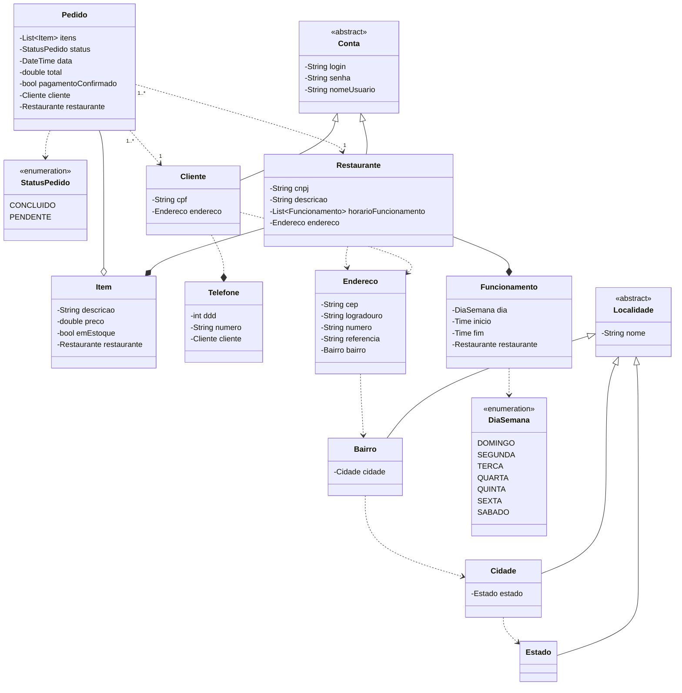

## Desafio final - DIO Santander Java Backend 2023

[&larr; Voltar](../README.md)

Solução: Desenvolver um protótipo de aplicação que simule o iFood

Trata-se de uma aplicação multi-tenant em que o database e o schema são compartilhados

### Observações

- O sistema de pagamentos foi desconsiderado devido sua complexidade que pode ser implementados em futuras versões, seja integrando uma API de pagamentos terceirizada ou desenvolvendo um subsistema de pagamentos próprio.

Segue abaixo o diagrama de classes de um MVP.

### Diagrama de classes

[&larr; Voltar](../README.md)