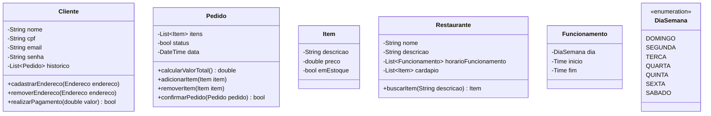

```mermaid
classDiagram
    class Cliente{
        -String nome
        -String cpf
        -String email
        -String senha
        -List~Pedido~ historico
        +cadastrarEndereco( Endereco endereco )
        +removerEndereco( Endereco endereco )
        +realizarPagamento( double valor ) bool
    }
    class Pedido{
        -List~Item~ itens
        -bool status
        -DateTime data
        +calcularValorTotal() double
        +adicionarItem( Item item )
        +removerItem( Item item )
        +confirmarPedido( Pedido pedido ) bool
    }
    class Item{
        -String descricao
        -double preco
        -bool emEstoque
    }
    class Restaurante{
        -String nome
        -String descricao
        -List~Funcionamento~ horarioFuncionamento
        -List~Item~ cardapio
        +buscarItem( String descricao ) Item 
    }
    class Funcionamento{
        -DiaSemana dia
        -Time inicio
        -Time fim
    }
    class DiaSemana{
        <<enumeration>>
        DOMINGO
        SEGUNDA
        TERCA
        QUARTA
        QUINTA
        SEXTA
        SABADO
    }

```