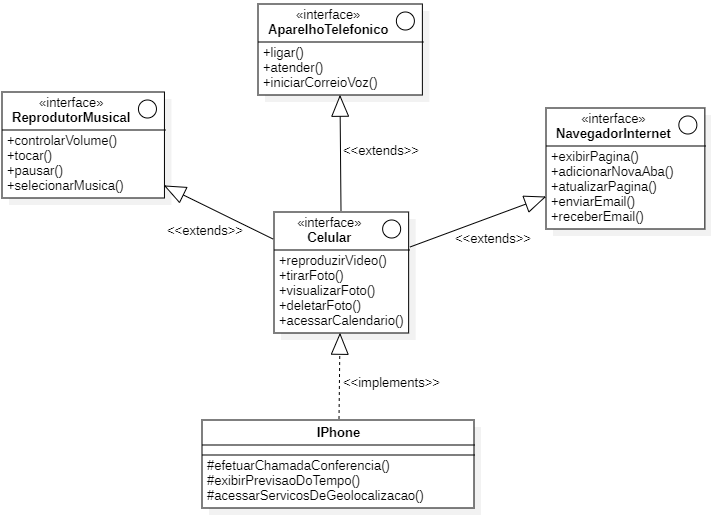

## Desafio POO - Bootcamp Dio Santander 2023

[&larr; Voltar](../../README.md)

- [Link do enunciado](https://github.com/digitalinnovationone/trilha-java-basico/tree/main/desafios/poo#poo---desafio) do desafio.

- Imagem da solução do desafio.

Observação: O diagrama de classes foi criado através do `StarUML`

- Conforme solicitado, na [pasta `src`](src/) encontram-se os arquivos java das interfaces e classes definidas pelo diagrama acima.

- A [imagem](assets/Iphone-DiagramaDeClasse.PNG) e o [arquivo fonte](assets/Iphone-desafio.mdj) do diagrama produzido encontra-se na [pasta `assets`](assets/)
